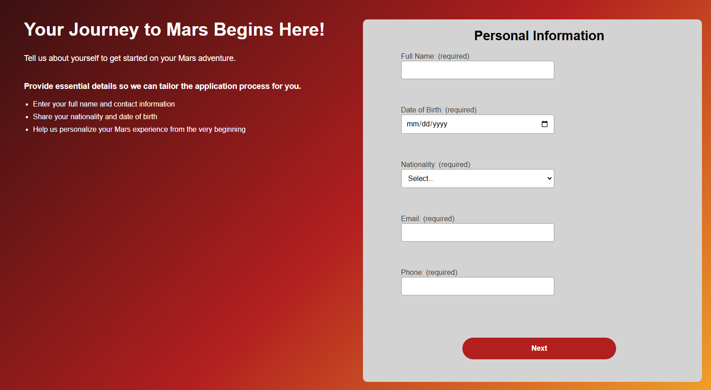

# mars-application

This is a multi-stage application form for a Mars visit, built using **Next.js**. The form includes three stages (personal information, travel preferences, and health and safety) and uses **JavaScript** and **CSS** for functionality and styling.

## Project Structure

- **js**: Contains form stage components in JavaScript.
- **pages**: Includes `_app.js` and `index.js` to manage routing and global settings in Next.js.
- **styles**: Contains `styles.css` for global styling.
- **test**: Unit tests for form validation.

## Screenshots

### Image 1



### Image 2


### Image 3


### Image 4


## Technologies Used

- **Next.js**: Framework for server-rendered React applications.
- **JavaScript**: For form logic and validation.
- **CSS**: For styling and layout.

## Setup

To run this project locally:

1. Clone the repository.
2. Install dependencies:
   ```bash
   npm install
   ```
