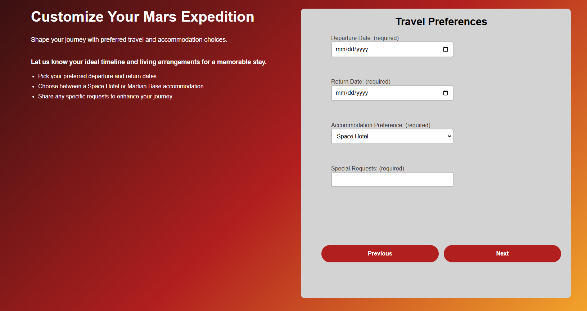
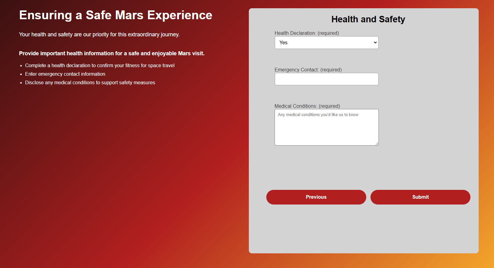
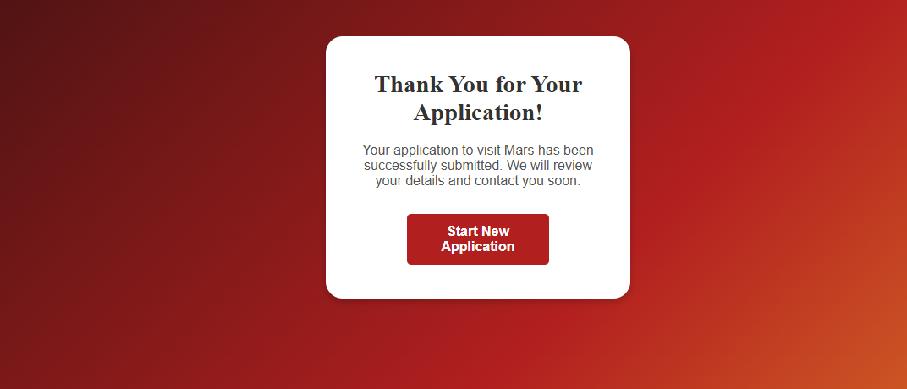

# mars-application

I created a multi-stage application form for a Mars tour visit, which I built using Next.js. The form itself includes three stages to complete, which are personal information, travel preferences, and health and safety. This project is able to showcase my ability to learn new tech and apply new technologies rapidly.

## Project Structure

- **js**: Contains form stage components in JavaScript.
- **pages**: Includes `_app.js` and `index.js` to manage routing and global settings in Next.js.
- **styles**: Contains `styles.css` for global styling.
- **test**: Unit tests for form validation.

## Screenshots

### Image 1


### Image 2



### Image 3



### Image 4



## Technologies Used

- **Next.js**: Framework for server-rendered React applications.
- **JavaScript**: For form logic and validation.
- **CSS**: For styling and layout.

## Setup

To run this project locally:

1. Clone the repository.
2. Install dependencies:
   ```bash
   npm install
   ```
